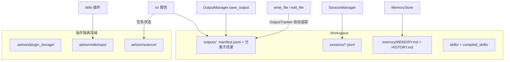
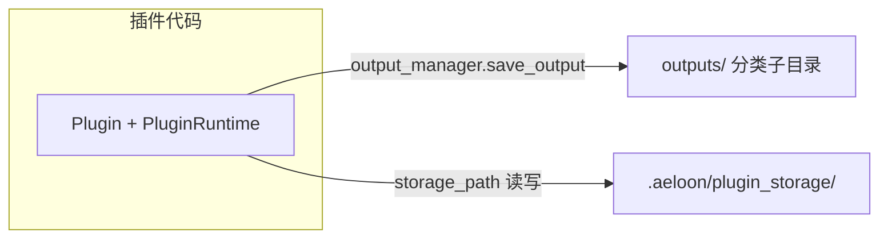

# Agent 产物落盘位置与数据流

本文说明 Aeloon 各模块（主 Agent Loop、插件、工具）产出的文件存放在哪里，以及它们与对话、记忆、会话系统如何关联。

**工作区根目录**记为 `<workspace>`，默认：`~/.aeloon/workspace`。

---

## 1. 目录总览

```
<workspace>/
├── outputs/                              ← 核心产物目录（统一追踪）
│   ├── manifest.jsonl                    ← 全局索引（自动维护）
│   ├── reports/                          ← 报告、总结、分析文档
│   ├── code/                             ← 脚本、程序、代码片段
│   ├── data/                             ← csv, json, 导出数据
│   ├── docs/                             ← 文档、教程、说明
│   ├── media/                            ← 图片、音频、视频
│   ├── misc/                             ← 其它无法归类的文件
│   └── research/                         ← Science 插件研究报告
├── sessions/*.jsonl                      ← 对话历史（按 channel:chat_id）
├── memory/
│   ├── MEMORY.md                         ← Prompt memory：稳定项目/环境事实（进 system prompt）
│   ├── USER.md                           ← Prompt memory：稳定用户偏好（进 system prompt）
│   └── HISTORY.md                        ← 时间线日志（grep 友好）
├── skills/                               ← 自定义技能
├── compiled_skills/                      ← 编译后的工作流
├── AGENTS.md, SOUL.md, USER.md, ...      ← 引导文件
└── .aeloon/plugin_storage/               ← 插件私有数据
    ├── aeloon/science/                   ← Science 插件任务状态
    └── aeloon/wiki/repo/                 ← Wiki 知识库
```

---

## 2. 谁把文件放在哪里

| 来源 | 产物类型 | 存放位置 | 自动记入 manifest? |
|------|---------|---------|-------------------|
| 主 Agent Loop `write_file` | 代码、报告等任意文件 | `outputs/<category>/`（prompt 引导） | **是** — OutputTracker 自动记录 |
| 主 Agent Loop `edit_file` | 编辑已有文件 | 原位 | **是** — OutputTracker 自动记录 |
| Plugin `output_manager.save_output` | 结构化成品（如 `/sr` 报告） | `outputs/<category>/` | **是** — save_output 直接写入 |
| Plugin `storage_path` | 插件内部状态、任务数据 | `.aeloon/plugin_storage/<id>/` | 否（私有数据） |
| SessionManager | 对话消息历史 | `sessions/*.jsonl` | 否 |
| PromptMemoryStore | Prompt memory（durable now, injected next real session） | `memory/MEMORY.md + USER.md` | 否 |
| LocalMemoryStore | Archive / timeline log | `memory/HISTORY.md` | 否 |

**被排除的系统路径**：`sessions/`、`memory/`、`skills/`、`compiled_skills/`、`.aeloon/` 下的写入不会被 OutputTracker 追踪。

---

## 3. 自动分类规则

OutputTracker 根据文件后缀自动推断分类：

| 分类 | 后缀 |
|------|------|
| `code/` | `.py` `.js` `.ts` `.jsx` `.tsx` `.sh` `.sql` `.html` `.css` `.go` `.rs` `.java` `.rb` |
| `data/` | `.csv` `.json` `.jsonl` `.ndjson` `.xml` `.yaml` `.yml` `.parquet` |
| `media/` | `.png` `.jpg` `.jpeg` `.svg` `.gif` `.webp` `.mp3` `.mp4` |
| `reports/` | `.md` `.txt` `.rst`（文件名含 report/summary/analysis/review/digest） |
| `docs/` | `.md` `.txt` `.rst`（不含上述关键词） |
| `misc/` | 其它所有后缀 |

若文件已在 `outputs/<subdir>/` 下，则直接沿用该子目录名作为分类。

---

## 4. 总览图：产物落在哪里



---

## 5. 主对话（Agent Loop）数据流

```mermaid
sequenceDiagram
    participant User
    participant Loop as AgentLoop
    participant Ctx as ContextBuilder
    participant Sess as SessionManager
    participant OM as OutputManager
    participant Tracker as OutputTracker
    participant Mem as MemoryConsolidator

    User->>Loop: 入站消息
    Loop->>Sess: get_or_create(session_key)
    Loop->>Ctx: build_messages + build_system_prompt
    Note over Ctx,OM: system prompt 含 Memory + Recent Outputs + 分类引导
    Loop->>Loop: run_agent_kernel（LLM + 工具调用）
    Note over Loop,Tracker: write_file 成功后 → OutputTracker.after_operation → manifest.jsonl
    Loop->>Sess: save_turn + save(session)
    Loop->>Mem: maybe_consolidate_by_tokens（后台）
    Note over Mem,OM: 合并 prompt 附带 output_summary（文件路径列表）
```

---

## 6. 插件两条"落盘"线



1. **用户可见成品** → `PluginRuntime.output_manager.save_output(...)` → `outputs/<category>/`，manifest 自动记录
2. **插件内部状态** → `PluginRuntime.storage_path` → `.aeloon/plugin_storage/<plugin_id>/`，不进 manifest

---

## 7. OutputTracker 追踪机制

OutputTracker 是一个 `file_policy` 回调，在 AgentLoop 启动时通过 `set_file_policy(tracker, append=True)` 注册：


- 通过 `ChainedPolicy` 支持与其他 policy（如插件注册的 policy）共存
- 仅追踪成功的 `write` / `edit` 操作（错误结果跳过）
- 系统路径（sessions/memory/skills 等）自动排除

---

## 8. Memory / History 与 Outputs 的关系

- **memory/MEMORY.md**：prompt memory，保存稳定项目/环境事实；进入 system prompt
- **memory/USER.md**：prompt memory，保存稳定用户偏好；进入 system prompt
- **memory/HISTORY.md**：仅追加的时间线日志，适合 grep 检索
- **PromptMemoryStore 冻结语义**：prompt memory 写入会立刻落盘，但同一 session 内不会重新注入；新的 prompt-memory 内容会在下一次真实新会话中进入 system prompt
- **合并（consolidation）**：当会话过长触发合并时，合并 prompt 附带 `output_summary`（来自 `OutputManager.build_output_summary`），使 `history_entry` 包含本阶段产生的文件路径
- **Recent Outputs**：system prompt 中注入最近 8 条 manifest 记录，方便 agent 引用已有产出

## 8.1 `USER.md` 命名注意事项

Aeloon 当前有两个不同位置的 `USER.md`：

- `<workspace>/USER.md`
  - bootstrap / prompt scaffold 文件
  - 由 `ContextBuilder.BOOTSTRAP_FILES` 读取
- `<workspace>/memory/USER.md`
  - prompt memory 文件
  - 由 `PromptMemoryStore` 管理

它们不是同一个概念，也不应该在实现里混用。

---

## 9. 快速查找

| 想找的内容 | 看这里 |
|-----------|--------|
| 最近所有产物列表 | `<workspace>/outputs/manifest.jsonl`，或对话里 `/outputs` |
| 某频道完整聊天记录 | `<workspace>/sessions/` 下对应 `.jsonl` |
| 稳定项目/环境事实（prompt memory） | `<workspace>/memory/MEMORY.md` |
| 稳定用户偏好（prompt memory） | `<workspace>/memory/USER.md` |
| bootstrap 用户说明文件 | `<workspace>/USER.md` |
| 按时间 grep 事件流 | `<workspace>/memory/HISTORY.md` |
| Science 任务内部数据 | `<workspace>/.aeloon/plugin_storage/aeloon/science/` |
| Wiki 索引的文档 | `<workspace>/.aeloon/plugin_storage/aeloon/wiki/repo/` |
| 最近的研究报告 | `<workspace>/outputs/research/` |
| Agent 写的代码文件 | `<workspace>/outputs/code/` |

---

*路径以 `config` 中的 `workspace` 与插件 `storage_base` 设置为准。*
